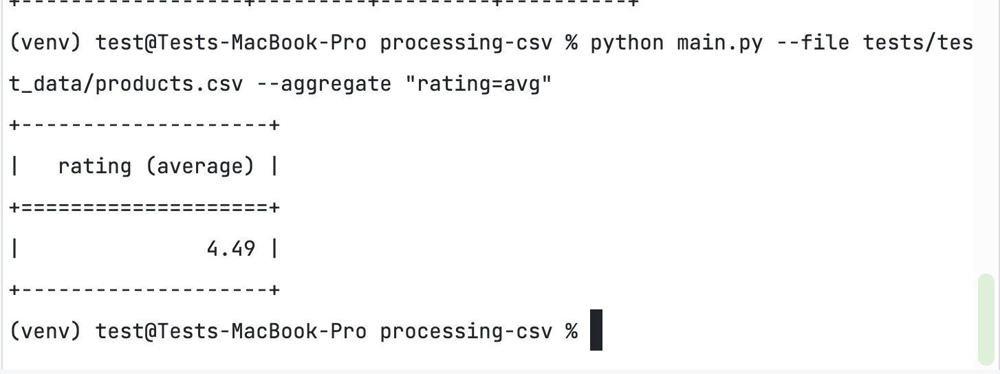
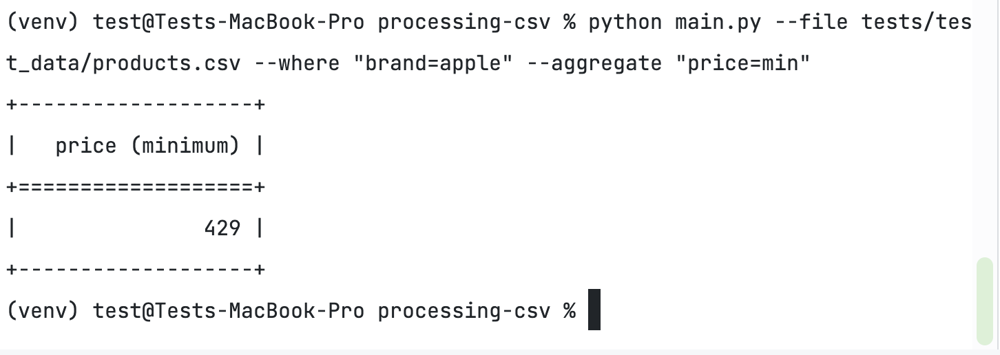
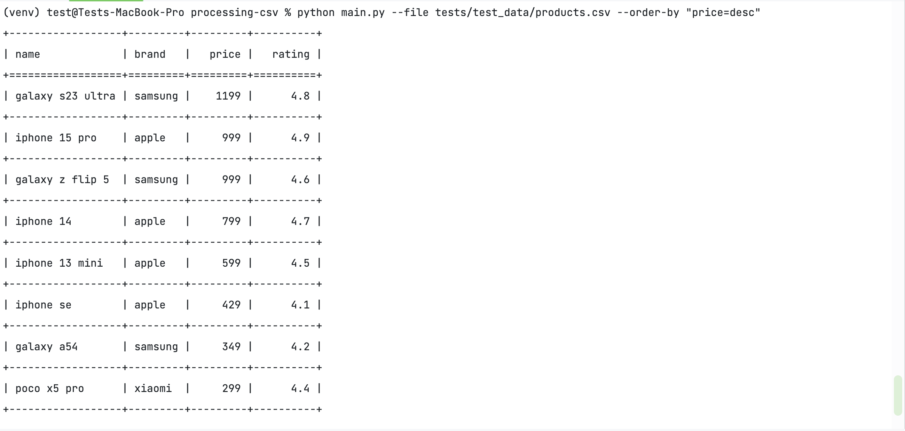
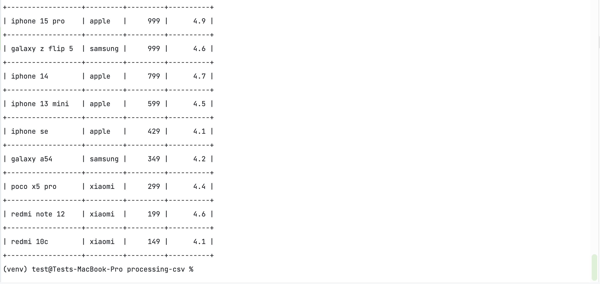
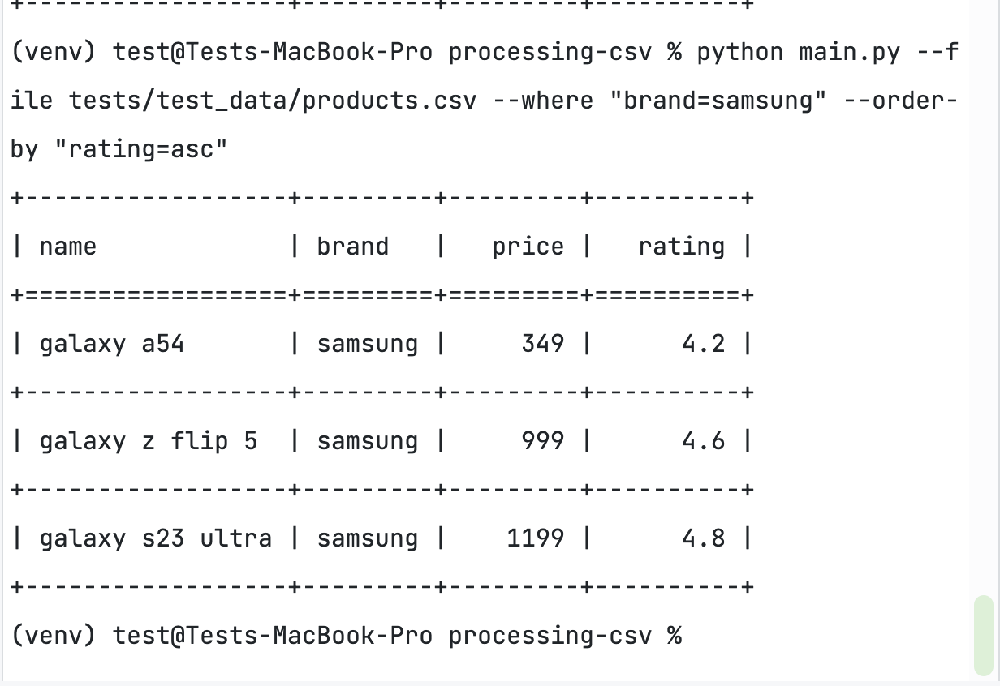
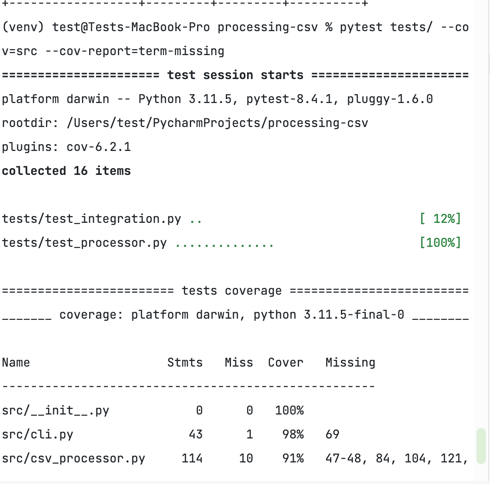
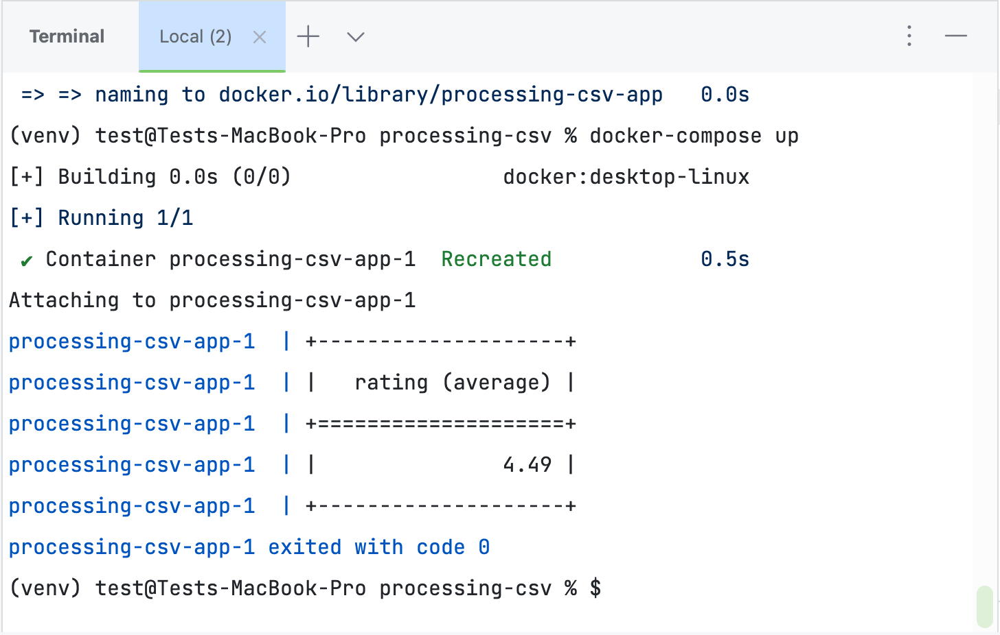
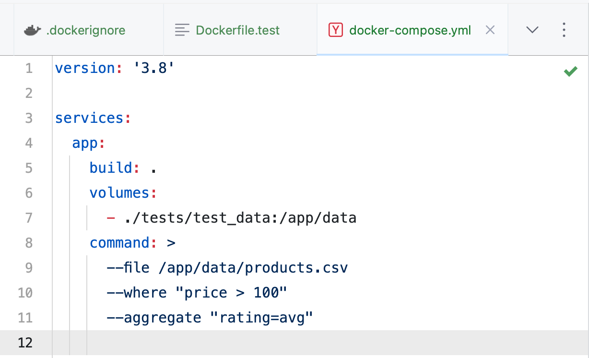

## ️Использование

###  Фильтрация

```bash
python main.py --file tests/test_data/products.csv --where "price>500"
```

<details>
<summary>Скриншот вывода</summary>


</details>

---

###  Агрегация

```bash
python main.py --file tests/test_data/products.csv --aggregate "rating=avg"
```

<details>
<summary>Скриншот вывода</summary>



</details>

---

###  Комбинированный запрос

```bash
python main.py --file tests/test_data/products.csv --where "brand=apple" --aggregate "price=min"
```

<details>
<summary>Скриншот вывода</summary>



</details>

---

###  Сортировка

```bash
python main.py --file tests/test_data/products.csv --order-by "price=desc"
```

<details>
<summary>Скриншот вывода</summary>



</details>

---

###  Фильтрация + сортировка

```bash
python main.py --file tests/test_data/products.csv --where "brand=samsung" --order-by "rating=asc"
```

<details>
<summary>Скриншот вывода</summary>



</details>

---

###  Pytest

```bash
pytest tests/ --cov=src --cov-report=term-missing    
```

<details>
<summary>Скриншот вывода</summary>



</details>

---

###  Docker

```bash
docker build -t processing-csv .
docker-compose up
```

<details>
<summary>Скриншот вывода</summary>



</details>

---

##  Аргументы

| Аргумент      | Описание                                                 |
| ------------- | -------------------------------------------------------- |
| `--file`      | Путь к CSV-файлу                                         |
| `--aggregate` | Агрегация данных по колонке (`avg`, `min`, `max`, `sum`) |
| `--where`     | Фильтрация по значению в колонке (`key=value`)           |

